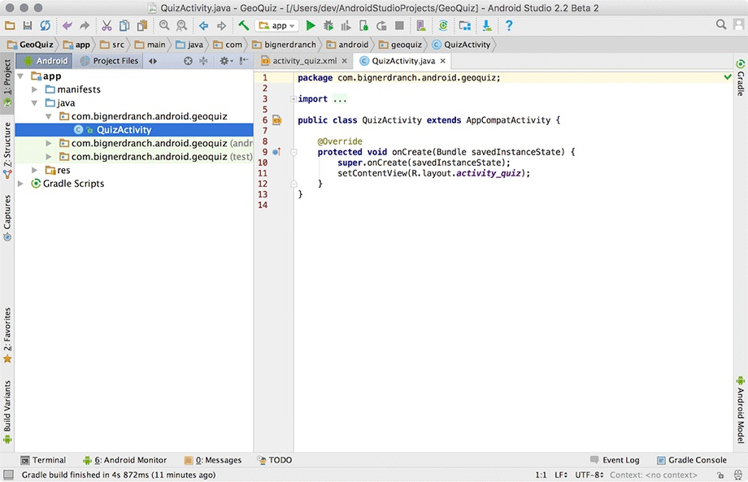

**پیش نیاز:**

نرم افزاری: نصب  [اندروید  استادیو](https://developer.android.com/studio) و SDK اندروید بنا بر سيستم عامل مورد استفاده(ویندوز لینوکس یا مک) ، نصب JDK، ‌نصب  [گیت](https://git-scm.com/downloads)

سخت‌افزار پیشنهادی: رم بالای ۸ گیگ و استفاده از SSD و استفاده از CPU ی مناسب

توجه: برای دانلود از منابع گوگل و همچنین استفاده از اندرویداستادیو نیاز به ابزارهای تغییر IP میباشد

1-قبل از اینکه شروع کنیم به ساخت پروژه ُ‌ نیاز است که با یکسری مفاهیم ابتدایی آشنا شویم ُ این مفاهیم ابتدایی در صفحات (1و2) کتاب مختصرا توضیح داده شده.

بعد از مطالعه این دو صفحه شما با مقدمات XML - Activity آشنا شده اید.

2-سپس نیاز داریم که با نحوه ساخت پروژه در اندروید استادیو آشنا شویم که به صفحات (3 تا 7) مراجعه کنید.

هیمنطور شما میتونید برای کسب اطلاعات بیشتر از لینک زیر استفاده کنید.

https://developer.android.com/training/basics/firstapp/creating-project

تا اینجای کار موفق شدیم یک پروژه جدید را ابجاد کنیم.

بعداز اتمام مراحل ساخت پروژه ُ‌دو فابل بصورت پیش فرض برای شما ایحاد میشود:
فایل QuizActivity.java

و همینطور فایل activity_quiz.xml که مربوط به UI اکتیویتی می باشد.

در نظر داشته باشید که محتوای این دو فایل ُ کد sample از پیش نوشته شده می باشد.صفحات(8و9)

3-برای آشنایی بیشتر با فایل xml ُ صفحات (10 تا 20) را مطالعه کنید.در این صفحات با مفاهیم ٰView - ViewGroup و برخی از Widget های پرکاربرد آشنا می شوید.

4-حالا برای آشنایی با نحوه استفاده از این ویجت ها ُ صفحات (21 تا 26) را مطالعه کتید تا با نحوه ست کردن ایونت کلیک و همینطور نمایش Toast آشنا شوید.

5-* برای اجرای اپلیکشن و تست اپلیکیشن ها می توانیم از یک device واقعی(موبایل) استفاده کنیم. اما زمان هایی که به device فیزیکی درسترسی نداریم یا میخواهیم در نسخه های مختلف اندروید برنامه‌مان را تست و اجرا کنیم میتوانیم از emulator در اندروید استادیو استفاده کنیم که نحوه ی ساخت و اجرای emulator در صفحه های ۲۷ تا ۲۹ و همینطور صفحات 46 و 47 کتاب مطالعه کنید.

6-بعد از اجرای کد ُ میخواهیم یکم درمورد مفاهیم پایه ای باهم صحبت کنیم ُ‌

در اندروید برای پیاده‌سازی و نوشتن کد های خود ُ از ‌معماری ها استفاده کنیم ُ‌ مفهوم معماری را در لینک زیر میتوانید مفصل مطالعه کنید.بعد از خواندن این لینک ُ متوجه میشوید که اصلا معماری چیست ُ‌ چرا از معماری استفاده میکنیم و چه نوع معماری هایی وجود دارد.

https://medium.com/android-news/architecture-patterns-in-android-abf99f2b6f70

حالا برای شناخت بیشتر معماری MVC ُ صفحات (33 تا 38) را مطالعه کنید.

7-آشنایی  با پوشه resource

برای اینکه با پوشه resource و محتویات درون آن آشنا شوید ابتدا لینک زیر را مطالعه کنید

https://www.geeksforgeeks.org/android-res-values-folder/

حالا برای آشنا شدن با انواع density های صفحه نمایش ها و همینطور طریقه افزودن ریسورس ها به این پوشه و استفاده از آنها در برنامه ‌صفحات(48 تا 51) را مطالعه کنید.

** راستی خیلی خوشحال می‌شویم برای کسب اطلاعات بیشتر این موارد را مطالعه نمایید :

- تفاوت  بین Button و ImageButton (صفحات 53و54)

- آشنایی با انواع API Level های اندروید(صفحات 113و114)

- آشنایی  با  مفاهیم Minimum SDK version ُ Target SDK version ُ Compile SDK version(صفحات 114 تا 119)

