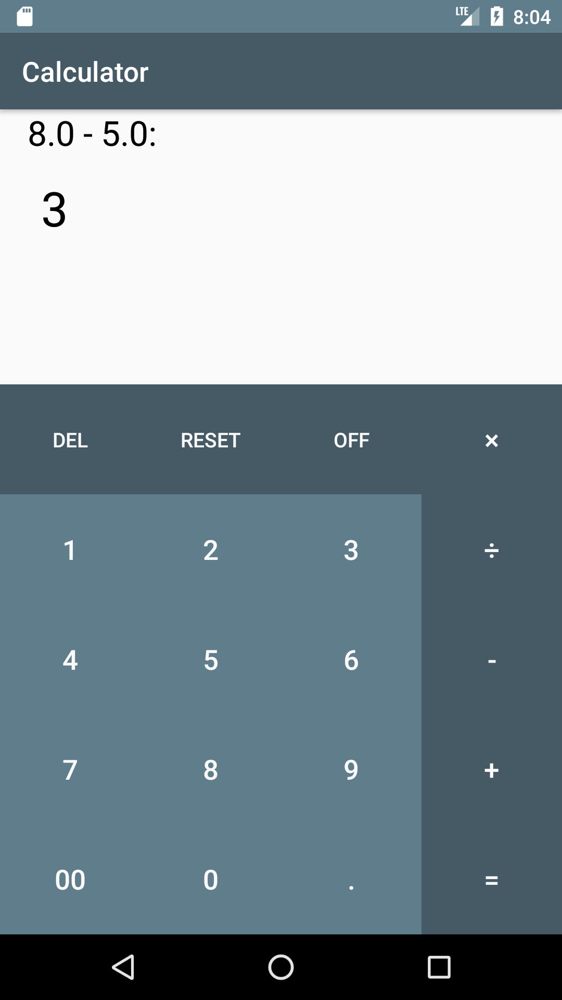

This issue template is based of [README.md](README.md) contents.
Click on "Raw" button on right side of this page to see original markdown then create a new issue with original content of this tasklist:

1- 
- [ ] Install Android studio and sdk
- [ ] Install Git
- [ ] setup Emulator

2- 
- [ ]   ساخت پروژه تستی جدید در اندروید استادیو    
- [ ]   قرار دادن یک دکمه در وسط صفحه با متن لخواه و نمایش Toast با متن "Hello Talkademy" با کلیک بروی Button

- [ ]   یک بار Layout زیر را با LinearLayout و سپس یک بار ReleativeLayout پیاده‌سازی کنید و پس از آن سراغ لاجیک این ماشین حساب بروید.    
  

3- معماری

- [ ]   آشنایی با مفهوم معماری و کاربرد آن      &nbsp;&nbsp;&nbsp;&nbsp; 

- [ ]   آشنایی با معماری های موجود و تفاوت آنها 

- [ ]   شناخت  و کاربرد پوشه res  در پروژه  

- [ ]   کاربرد پوشه های مختلف در res مانند anim,value,drawable 

- [ ]   افزودن یک ریسورس به این پوشه برای صفحه نمایش های متفاوت و نحوه استفاده از آن 

- [ ]   کاربرد و تاثیرات Minimum SDK version - Target SDK version در پروژه    `[FILL HERE ]`

