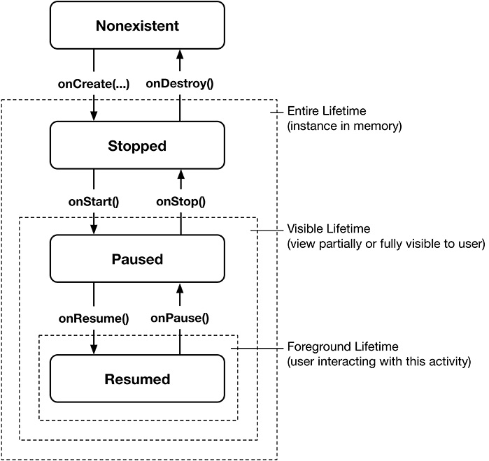

**آشنایی با LifeCycle activity و اکتیوتی دوم و دیباگ برنامه**

در فاز قبلی با اکتیویتی ها آشنا شدیم. در ادامه در بیشتر در مورد آن یاد میگیریم.

1- از زمانیکه یک اکتیویتی ساخته میشود تا وقتی که از بین میرود، یک چرخه‌ی حیاتی را طی میکند. سيستم عامل اندروید، زمانیکه یک برنامه در foreground ظاهر میشود ، یک سری از متدهایی که ما از Activity ها Override کردیم را به طور اتوماتیک صدا میزند. مثلا زمانیکه کاربر از برنامه ای که ما نوشتیم استفاده میکند و دکمه‌ی Home را فشار میدهد برنامه به حالت Pause میرود و اندروید متد onPause را صدا میزند و ما درون این متد مثلا دیتابیس را میبندیم. در ادامه یک نمای کلی از این متدهای متد را میتوانید مشاهده نمایید:

برای تسلط به این مباحث صفحات 55 تا 62 کتاب را مطالعه کنید.

تا اینجای کار ما با

- LifeCycle اکتیویتی ها

- نحوه ی Log نوشتن

آشنا شده‌ایم.

2- در ادامه میخواهیم با روال Rotate یا چرخاندن دستگاه آشنا شویم.

ما زمانی که دستگاه را به حالت افقی تغییر میدهیم ُ اتفاقاتی در سيستم عامل رخ می ددهد که شما میتونید در صفحات 63 تا 71 مطالعه کنید.

همینطور شما با مطالعه این قسمت ُ‌ با مفهوم

- SaveData

- Bundle

- متد Device configurations
- متد onSaveInstanceState

- Landscape or Portrait

آشنا می شوید.

** اشکال یابی یا Debugging در اپلیکیشن از اهمیت بسیار بالایی برخوردار است.با تسلط به تکنیک Debuggingُ شما می توانید سریعتر اشکالات گزارش شده در اپلیکیشن را پیدا و رفع کنید.

برای اینکه به این مبحث مسلط شوید ُ‌لازم است که این لینک را مطالعه و سپس تمرین کنید:

https://developer.android.com/studio/debug

3- تااینجا ما با برنامه‌ی تک Activity آشنا شدیم‌ ُ در ادامه میخواهیم با برنامه‌ی چند Activity آشنا شویم که می بایست صفحات گفته شده را مطالعه نمایید.

- ابتدا برای آشنایی با ساخت یک Activity ، صفحات  91 تا 96 را مطالعه نمایید.

- سپس پس از یادگیری ساخت Activity جدید ُ‌ آن را می بایست به Manifest پروژه خود معرفی کنیم که توضیحات مربوط به فایل Manifest و نحوه ثبت Activity جدید در صفحه 97 وجود دارد.

-پس از معرفی آن در فایل Manifest  ، حالا می خواهیم آن Activity را نمایش دهیم ُ‌برای نمایش یا به اصطلاحا استارت Activity خود ، صفحات 99 تا 101 را را مطالعه نمایید.همینطور شما در این بخش از کتاب با Intent  و انواع Intent ها آشنا می‌شوید.

- گاهی اوقات نیاز هست که از یک اکتویتی Dataیی را به عنوان جواب دریافت کنیم. در صفحات 101 تا 109 شما با نحوه انتقال Data بین دو Activity یا هندل کردن Result نمایش یک Activity(متد startActivityForResult) آشنا می شوید.

** برای کسب اطلاعات تکمیلی میتوانید صفحات 109 تا 112 را مطالعه کنید.

