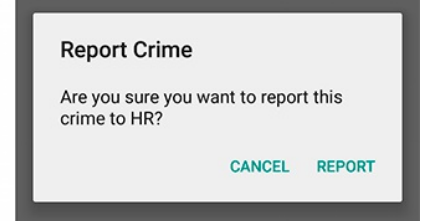
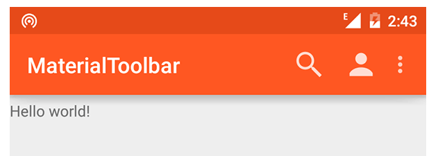

1-در مطالب قبل ، ما با نحوه ارسال دیتا بین دو Activity را آشنا شده ایم اما در این فصل قرار است ما شیوه ارسال دیتا از طریق Fragment به Activity یا برعکس را فرا بگیریم.

ابتدا در صفحه 205 تا 206 یاد میگیریم که چجوری یک اکتیویتی را از توی فرگمنت استارت کنیم.

برای ارسال یا put دیتا از طریق فرگمنت به اکتیویتی از Intent استفاده میکنیم، طریقه ارسال به اکتیویتی و همینطور دریافت یا get دیتا در اکتیویتی (با متد getSerializableExtra) را میتوانید در صفحات 207 و 208 مشاهده کنید.

2-حالا اگر بخواهیم یک دیتایی را به فرگمنت ارسال کنیم ، میتوانیم از آبجکت Bundle به عنوان  Argument آن فرگمنت استفاده کنیم.صفحه 210

در صفحه 210 نحوه پیشنهادی Google برای ساخت یا(New کردن) فرگمنت را مشاهده میکنید.همینطور در این متد طریقه ساخت Argument و ست کردن آن به فرگمنت و برعکس واکشی آن دیتا را هم فرا میگیرید.

در ادامه ما با طریقه فراخوانی Fragment.startActivityForResult در فرگمنت و نحوه هندل کردن Result را نیز آشنا می شویم(صفحه 215)

**3- ViewPager**

تا اینجای کار ما به فرگمنت ها مسلط شدیم، در این قسمت میخواییم با ابزار ViewPager آشنا شویم.

شاید در برخی از اپلیکیشن ها دیده باشید که با حرکت دست به سمت چپ یا راست(Swipe به چپ و راست) فرگمنت ها تغییر میکنند یا مثلا همونجور که در گالری مشاهده میکنید با Swipe به چپ یا راست میتونید تصاویر را جابجا کنید.بوسیله ViewPager میتوانیم این قابلیت Swipe را پیاده سازی کنیم.

خب برای اینکه بطور مختصر با ViewPager آشنا بشید ، لطفا صفحات 217 تا 219 را مطالعه نماید و همینطور برای مطلع شدن از امکاناتی که ViewPager به ما میدهد نیز می توانید لینک زیر را ببینید:

https://developer.android.com/training/animation/screen-slide

**4- PagerAdapter**

همونجور که با کلاس Adapter در بخش RecyclerView آشنا شدید ، برای پیاده سازی ViewPager نیز ما نیاز به PagerAdapter داریم.برای شناخت نحوه پیاده سازی کلاس Adapter به صفحات 219 تا 222 رجوع کنید.

در صفحات 223 و 224 هم میتوانید با انواع PagerAdapter های ViewPager مانند FragmentStatePagerAdapter و FragmentPagerAdapter آشنا شوید و تفاوتش را درک کنید.

برای کسب اطلاعات بیشتر میتونید صفحات 224 تا 226 را مطالعه کنید تا براتون جا بیوفته که ViewPager دقیقا چطور کار میکند.

**5- Dialogs**

دیالوگ یک پیغام نمایشی است که روی اکتیویتی نمایش داده می‌شود تا بتوانیم یک پیغامی را به کاربر نشان دهیم. مثلا اگر کاربر بخواهد یک آیتمی را حذف کند، یک پیغام به عنوان هشدار نشان می‌دهد که “آیا از حذف آیتم مطمئن هستید؟” و گزینه‌ی بله و خیر هست که کاربر می‌تواند هرکدام را انتخاب کند.

دیالوگ ها بسیار بسیار ساده و کاربردی هستن که شما میتونید توضیحات کامل درمورد نمایش آنها و انواع آنها را در صفحات 227 تا 234 ببینید.در این صفحات شما با DialogFragment هم آشنا می شوید که دیالوگ های پرکاربردی هستند.

**6- Toolbar**

همینطور که در تصویر بالا مشاهده میکنید ، تولبار همان نوار بالای صفحه بوده که می‌تواند شامل عنوان صفحه (title)، لوگو، منو، گزینه جستجو و… باشد.
Toolbar در ویرایش 5.0 سیستم عامل اندروید جای actionbar در اندروید 4 را گرفت تا محدودیت های جاری را برطرف ساخته و راه حلی نوین برای طراحی اپلیکیشن را در اختیار برنامه نویس قرار دهد. این widget یا کامپوننت UI از طریق view group به نام Toolbar در دسترس توسعه دهنده قرار می گیرد.برای آشنایی با جزئیات این ابزار، صفحات 247 تا 249 را مطالعه نمایید.
در ادامه شما نیاز به اضافه کردن منو در تولبار را دارید که میتونید به صفحات 250و255 مراجعه کنید.همیطنور برا ی آشنا شدن با طریقه هندل کردن منوی کلیک شده می بایست صفحات 256 تا 258 را بخوانید.
**برای کسب اطلاعات بیشتر و دانستن تفاوت ActionBar  و Toolbar ، صفحه 267 را مطالعه کنید.

