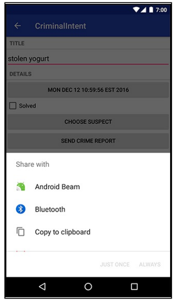

<div dir="rtl" align='right'>

همونطور که در فصل های گذشته صحبت کردیم ، Intent ها دونوع بودند که در فصل های قبل با نوع Explicit(مثلا برای باز کردن یک اکتیویتی دیگر) آشنا شدیم.برای مثال:
<div dir="ltr" align='left'>

```
 Intent intent = new Intent(getActivity(), SecondActivity.class);
 intent.putExtra(EXTRA_CRIME_ID, crimeId);
 startActivity(intent);
```
</div>


نوعی دیگر از Intent ها ، Implicit Intents می باشند که زمانی از آن استفاده می کنیم که مقصد(گیرنده آن Intent) خاصی مدنظرمان نباشد و خوده سیستم عامل این رو تشخص میده که مثلا کدام یک از Application های نصب شده بروی Device شما، این Intent را پشتیبانی میکند.آنوقت سیستم عامل آن را به شما پیشنهاد میدهد.مثلا فکرکنید میخواهید یک متن را از اپلیکیشن خودتان به بیرون اشتراک‌گذاری کنید ، وقتی گزینه Share را میزنید ، سیستم عامل همه اپلیکیشن هایی که این قابلیت را دارند که متن را بعنوان ورودی دریافت کنند را به شما نمایش میدهد.در ادامه بیشتر به این موضوع میپردازیم.
<div dir="ltr" align='left'>

```
    Intent i = new Intent(Intent.ACTION_SEND);
    i.setType("text/plain");
    i.putExtra(Intent.EXTRA_TEXT, getCrimeReport());
    i.putExtra(Intent.EXTRA_SUBJECT, getString(R.string.text));
    startActivity(i);
```
</div>
با فراخوانی این تیکه کد ، سیستم عامل برنامه هایی که این قابلیت رو ساپورت میکنن را نمایش میدهد 



برای اینکه از جزئیات این نوع Intent آشنا شوید ، صفحات 294 تا 298 را مطالعه نمایید.

حالا برای تمرین بیشتر میتونید صفحات 299 تا 301 را مطالعه کنید که در این صفحات نحوه انتخاب کانتکت از لیست مخاطبین توضیح داده شده.
به یاد داشته باشید که برای نمایش لیست مخاطبین ، شما به دسترسی(Permission) مخاطبین یا Contact نیاز دارید.که برای مطالعه بیشتر میتونید این لینک رو مطالعه کنید:

https://www.geeksforgeeks.org/android-how-to-request-permissions-in-android-application

همینطور برای کار با Camera و هندل کردن یا نمایش دادن عکس گرفته شده توسط دوربین ، میتونید فصل 16 را مطالعه کنید. 
     

برای لود یا نمایش بهینه تصاویر ، می تونید از کتابخانه های موجود مانند Glide یا Picasso یا Fresco یا… استفاده کنید که در لینک زیر نحوه پیاده‌سازی و استفاده از کتابخانه Glide را میبینید:

https://guides.codepath.com/android/Displaying-Images-with-the-Glide-Library 

 

برای آشنایی با نحوه طراحی و پیاده‌سازی Layout های مربوط به Tablet یا اصطلاحا Two-Pane View و همینطور نمایش چند فرگمنت در یک اکتیویتی و طریقه ارتباط دو فرگمنت با هم، فصل 17 یا لینک زیر را مطالعه کنید. 

https://guides.codepath.com/android/flexible-user-interfaces#creating-a-two-pane-view


</div>