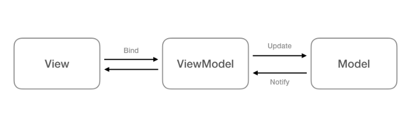

**1- Localization**

حتما برخی از اپلیکیشن ها را دیدید که از چند زبان پشتیبانی میکنند و شما میتونید زبان دلخواه خود را در اپلیکیشن انتخاب کنید.برای اینکه بتونید از قابلیت چندزبانه اپلیکیشن خود پشتیبانی کنید، می بایست ابتدا فایل string ترجمه خود را درون یک پوشه که با پیشوند -values شروع میشود قرار دهید و سپس آن پوشه را در پوشه res اپلیکیشن خود قرار دهید.برای مثال اگر بخواهیم زبان فارسی را اضافه کنیم، یک پوشه با نام values-fa که حاوی یک فایل با نام و پسوند strings.xml می باشد را در پوشه res کپی میکنیم.حالا برای اینکه از نحوه استفاده این قابلیت بطور کامل مطلع شوید ، فصل 18 را مطالعه نمایید ، همینطور شما در این بخش با ساخت فایل های string متفاوت طبق سایز صفحه نمایش هم فرا میگیرید

**2- Data Binding and MVVM**

**معماری MVVM**

در ایتدا یک توضیح مختصری در مورد معماری MvvM ارائه میکنیم سپس به مبحث DataBinding می پردازیم

MVVM (یعنی Model، View، ViewModel) یک الگوی معماری برنامه است که به عنوان جایگزینی برای الگوهای MVC و MVP هنگام استفاده از فناوری Data Binding پیشنهاد شده است. MVVM یک الگوی طراحی معماری نرم‌افزار است که جداسازی رابط کاربری از business logic و مدل داده (data model) برنامه را تسهیل می‌بخشد.

برای کسب اطلاعات در مورد اجزاء این معماری و همینطور نحوه پیاده‌سازی این معماری میتونید لینک زیر را مطالعه کنید:

https://www.geeksforgeeks.org/mvvm-model-view-viewmodel-architecture-pattern-in-android/

**Data Binding**

همونجور که میدونید ، یک برنامه ساده از تعداد زیادی View ساخته میشه؛ برای مثال TextView که متن رو شامل میشه یک View هستش یا همینطور ImageView که شامل عکس های پروژه میشه یا... همونطوری که میدونید برای ساخت ظاهر برنامه در اندروید از زبان xml استفاده میشه، در واقع ما المنت های رابط کاربری مون رو در xml میسازیم و سپس ویو هایی که ساختیم رو در سمت Java معرفی میکنیم تا بتونیم باهاش منطق برنامه رو بسازیم. 

خب این یک فرایند ساده ساخت رابط کاربری توی اندروید بود، اما چرا باید از Data Binding استفاده کنیم؟

بصورت سنتی با متد findViewById ما هر بار میاییم و یک View میسازیم و بعد از اون میاییم Data رو بر روی این View ست میکنیم(یا حالا هرکاری که بخوایم با اون View انجام میدیم)؛ اما این کار همونطوری که مطلع هستید خیلی وقت گیر و زمان بر هستش؛ Data Binding اومده تا این فرایند رو کوتاه تر کنه تا خوانایی کد بهتر شود؛ به این صورت که میتونیم Data Model مون رو بصورت مستقیم به لایه xml پاس بدیم و دیگه نیازی به معرفی ویو در Java و ست کردن مقدار اونجا نیست؛ یعنی شما با حذف کردن حدودی ست کردن دیتا روی View در جاوا، دیتا رو مستقیما به رابط کاربری توی xml میفرستید و از اونجا داده مستقیما روی View شما ست میشه! یعنی شما عملا دارید میانبر میزنید! 

در فصل ۲۰ مبحث DataBinding در Mvvm بطور مختصر توضیح داده شده.

**3- SoundPool**

اندروید به منظور پخش صدا دو API اصلی ارائه می دهد. اولین آن ها کلاس SoundPool و دیگری کلاس MediaPlayer می باشد. کلاس SoundPool ویژه ی کلیپ های صوتی کم حجم بکار گرفته می شود. این کلاس قادر است صداها را تکرار کرده و همچنین چندین صدا را به طور همزمان پخش کند. فایل های صوتی که با SoundPool پخش می شوند نباید از 1 مگابایت بیشتر باشد.برای آشنایی بیشتر و نحوه پیاده‌سازی این کلاس ، صفحات 399 تا 402 را مطالعه نمایید.همینطور میتونید برای نحوه نوشتن تست این قابلیت، صفحات 402 تا 410 را مطالعه کنید.

**4- Styles and Themes**

در فصل 22 ، شما با مباحث زیر آشنا می شوید:

- کار با Color ها و نحوه تعریف و استفاده از آنها

- کار با فایل Style و نحوه تعریف استایل ها و طریقه استفاده از آنها در ویجت های اندروید مانند Button یا ...

- کار بار خصوصیت Theme اپلیکیشن و تاثیر آن در تمام اپلیکیشن

- انواع تم های زیرمجوعه Theme.AppCompat مانند (Theme.AppCompat.Light یا Theme.AppCompat.Light.DarkActionBar یا ...)

- با ویژگی های colorPrimary و colorPrimaryDark و colorAccent در Styles

**5- XML Drawables**

در فصل 23 ، شما با شی Drawable آشنا می شوید.ابتدا یک توضیح مختصری از Drawable و انواع آنها ارائه میکنیم :

Drawable یک مفهوم کلی در اندروید برای هر فایل گرافیکی قابل ترسیم می باشد یا به عبارت دیگر drawable هر چیزی است که بتوان آن را بروی فضای صفحه نمایش کشید.

هر drawable در قالب یک فایل مجزا در مسیر res/drawable ذخیره می شود. معمولا فایل های drawable در قالب فایل های bitmap در وضوح مختلف داخل زیرپوشه های –mdpi ، hdpi- xhdpi – xxhdpi مسیر res/drawable ذخیره می شوند. اگر bitmap ها در پوشه ی متفاوتی ذخیره شده باشند، سيستم اندروید خود تنظیمات دستگاه و اندازه ی صفحه نمایش را ارزیابی کرده و بر اساس آن گزینه ی مناسب را انتخاب می کند.

علاوه بر فایل های گرافیکی، اندروید از drawable های مبتنی بر XML و 9-patch پشتیبانی می کند. drawable های که در فایل های XML تعریف می شوند به برنامه نویس این امکان را می دهد تا رنگ، حاشیه، شیب/طیف رنگ و گوشه ها را در قالب تگ shape و همچنین state (جهت تعریف عکس خاص برای هر وضعیت ای که view در آن قرار می گیرد)، transition (برای تعریف انیمیشن) فایل گرافیکی مورد نظر را تعریف کند. 

به وسیله ی فایل های گرافیکی 9-patch می توان مشخص کرد که در صورت بزرگتر بودن view میزبان، کدام بخش از فایل گرافیکی مورد نظر می بایست کشیده (بزرگتر) شود. 

فایل های Drawable را می توان با کدهای Java نوشت. هر آبجکتی که توابع اینترفیس Drawable را پیاده‌سازی می کند را می توان به صورت فایل ترسیم شونده/Drawable در کد بکار برد. 

Shape ها نیز یک نوع drawable هستند که در فرمت XML تعریف شده و به توسعه دهنده این امکان را می دهند تا آبجکت یا اشکال هندسی با رنگ، حاشیه و شیب رنگ تعریف نمایند. می توانید این اشکال هندسی را به view های مورد نظر تخصیص داده و از آن ها در المان های رابط کاربری استفاده نمایید. مزیت استفاده از shape در این است که خود را به صورت اتوماتیک به مقیاس مناسب تنظیم می کند. 

در این فصل (23) شما علاوه بر مباحث بالا ، با Layer List Drawable ها و نحوه استفاده از 9-patch ها را هم فرا میگیرید.

