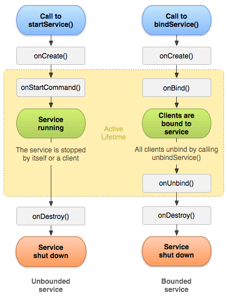

در این بخش میخواهیم درمورد دو کامپوننت پرکاربرد اندروید صحبت کنیم:

 - Service
 - Broadcast Receiver 

**1- Service** 

یکی از کامپوننت‌های پرکاربرد در سيستم عامل اندروید محسوب می‌شود. از کامپوننت Service برای اجرای عملیات و پردازش‌های طولانی مدت و تکرار شونده در پس زمینه (Background) استفاده می‌شود. پردازش‌هایی که ارتباطی با رابط کاربری (UI) نداشته و باید بدور از چشم کاربر انجام شود. منظور از اجرا در پس زمینه این است که مهم نیست برنامه باز باشد یا بسته. یعنی بعد از اجرای سرویس، حتی اگر کاربر از برنامه ما خارج شد و برنامه دیگری را باز کرد هم سرویس در پشت صحنه به کار خود ادامه می‌دهد. به طور خلاصه می‌توان گفت Service ‌ها هیچ وابستگی به چرخه حیات Activity ندارند.

برای مثال یک برنامه پخش موزیک را درنظر بگیرید. در حالت عادی اگر پخش فایل‌های صوتی داخل یک اکتیویتی انجام شود، به محض خروج کاربر از برنامه و یا حتی در صورتی که یک اکتیویتی دیگر از برنامه را باز کند، پخش صوت متوقف خواهد شد. در حالی که کاربر انتظار دارد با خروج از برنامه یا رفتن به سایر صفحات برنامه (مانند لیست آلبوم‌ها و…) بازهم پخش موسیقی ادامه پیدا کند.

یا برنامه مدیریت دانلود (Download Manager) یک مثال دیگر برای کاربرد Service در اندروید است. زمانی که کاربر در حال کار با برنامه دیگری است یا حتی هنگامی که دستگاه در حالت idle (بیکاری) قرار دارد هم این برنامه باید بتواند فایلی که دانلود آن قبلا آغاز شده را در پس زمینه ادامه داده و با خروج کاربر از برنامه و متوقف شدن اکتیویتی، عملیات دانلود متوقف نشود. به عبارت دیگر چنانچه برنامه نویس کامپوننت سرویس را در برنامه پیاده‌سازی نکند، کاربر برای دانلود فایل مجبور است تا اتمام فرایند دانلود در برنامه و صفحه‌ی دانلود باقی بماند!

خب تا اینجای کار با کاربرد سرویس آشنا شدیم ، حالا میخواییم به انواع سرویس ها و کاربردشون بپردازیم

به طور کلی سرویس‌ها در اندروید دو نوع هستند:

Started Services و Bound Services

که Started Services به دو دسته تقسیم می‌شود ،

Background Service: سرویسی است که پردازشی را بدون اطلاع کاربر در پس زمینه انجام می‌دهد.

Foreground Service: سرویسی است که پردازش را توسط یک نوتیفیکیشن (Notification) به کاربر اطلاع می‌دهد.(مانند دانلودر فایل یا موزیک پلیر یا ...)

**2- IntentService :**

همونطور که میدانید ، Service در Main Thread اجرا می شود و اگر یک سرویس طولانی مدت MainThread را اشغال کند ، باعث هنگ کردن برنامه و UI می شود.

استفاده از IntentService باعث می شود که سرویس ما از Main Thread جدا بشه و باعث هنگ کردن برنامه و UI نشه.برای آشنایی با پیاده‌سازی IntentService ، صفحات 537 تا 543 را مطالعه کنید.

برای اطلاعات بیشتر در مورد Service ها میتونید لینک های زیر را مطالعه کنید:

https://android-developers.googleblog.com/2010/02/service-api-changes-starting-with.html
https://developer.android.com/guide/components/services
https://developer.android.com/reference/android/app/Service.html
https://developer.android.com/guide/components/bound-services

**۳- Alarm Manager :**

گاهی اوقات میخواهیم که بعضی از عملیات ها در زمان دیرتری اتفاق بیوفتند، برای مثال در زمانبندی SMS میخواهیم یک SMS چند ساعت بعد ارسال شود یا برای مثال برنامه های To-Do List که میخواهیم یک اخطار بعدا به ما داده شود، کلاس AlarmManager دسترسی ما را به سيستم های Alarm فراهم میکند، این کار باعث میشود بتوانید عملیات مورد نظرتان در زمانی که میخواهید انجام دهید.

Alarm Manager بخشی از CPU را اشغال میکند و تا زمانی که متد ()onReceive فعال است، آن بخش از CPU را اشغال میکند.

برای اطلاعات بیشتر درمورد آلارم منیجر ، میتونید صفحات 544 تا 547 را مطالعه و یا به لینک زیر مراجعه کنید:
https://developer.android.com/training/scheduling/alarms#java

https://www.javatpoint.com/android-alarmmanager

**۴- WorkManager**

 شما میتونید درمورد WorkManager و همینطور JobScheduler در لینک های زیر اطلاعات کسب کنید:

https://developer.android.com/topic/libraries/architecture/workmanager/basics

https://developer.android.com/reference/android/app/job/JobScheduler

**۵- Broadcast Receiver :**

گاهی اوقات لازم است اپلیکیشن ما بر اساس یک وضعیت یا رویداد که در سيستم عامل یا سایر برنامه‌ها اتفاق افتاده واکنش نشان داده و متناسب با آن پاسخ دهد که با استفاده از کامپوننت‌ BroadcastReceiver امکانپذیر است. در واقع برودکست رسیورها به ما اجازه می‌دهند تا رویدادهای سيستم عامل یا برنامه‌ها را دریافت کنیم. در این قسمت به معرفی این کامپوننت می‌پردازیم.

فرض کنید قصد ساخت اپلیکیشنی را داریم که وابستگی زیادی به شبکه اینترنت دارد و می‌خواهیم قطع و وصل ارتباط اینترنتی را به محض وقوع، به اطلاع کاربر برسانیم.

در مثالی دیگر، برنامه‌ای داریم که ورود کاربر توسط دریافت کد تایید از طریق پیامک (SMS) انجام می‌شود و می‌خواهیم بدون نیاز به وارد کردن دستی کد تایید توسط کاربر، به محض دریافت پیامک، کد دریافتی به برنامه منتقل شود.

در این موارد لازم است برنامه ما به رویدادها و وضعیت سيستم عامل دسترسی داشته باشد تا بتواند اتصال یا عدم اتصال به اینترنت و همچنین دریافت پیامک را بررسی کند. در اینجا با استفاده از BroadcastReceiver به پیغام‌های مرتبط با رویداد مدنظرمان گوش داده سپس اقدام مناسب را انجام می‌دهیم.

به عبارتی دیگر، سيستم عامل اندروید برای وقوع تعدادی رویداد و وضعیت خاص، پیغامی همگانی صادر می‌کند که هر برنامه می‌تواند بر اساس نیاز خود، این پیغام‌ها را دریافت کند. البته این پیغام‌ها محدود و منحصر به سيستم عامل نبوده و برنامه‌ها هم می‌توانند پیغام‌های سفارشی خود را منتشر کرده تا سایر برنامه‌ها آنرا دریافت کنند.

برای نحوه پیاده‌سازی BroadcastReceiver فصل 29 را مطالعه کنید، همینطور میتونید از لینک زیر استفاده کنید :

https://www.tutorialspoint.com/android/android_broadcast_receivers.htm

https://www.vogella.com/tutorials/AndroidBroadcastReceiver/article.html

